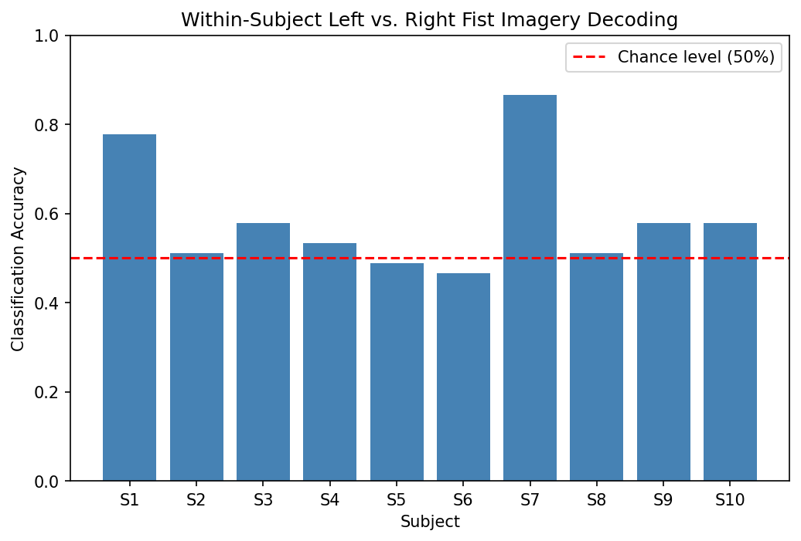
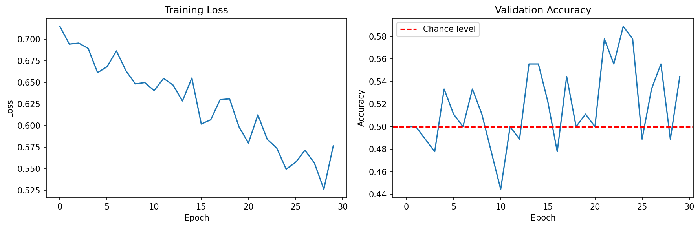
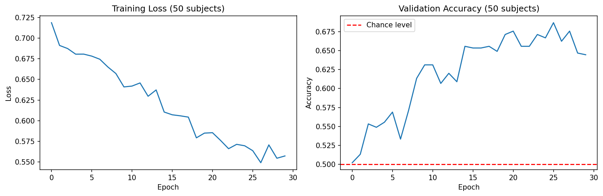

# EEG Motor Imagery Classification

Classifying imagined left vs. right fist movement from EEG signals, comparing
classical machine learning and deep learning approaches, and investigating how
both individual variability and dataset size affect decoding performance. This
project applies signal processing and decoding techniques from brain-computer
interface (BCI) research.

## Motivation
Brain-computer interfaces (BCIs) offer a pathway for individuals with severe motor
impairments (e.g. ALS, locked-in syndrome) to communicate and control devices using
brain activity alone. This project investigates whether imagined hand movements can be reliably decoded from EEG signals, comparing a classical machine learning approach (CSP + SVM) against a deep learning approach (CNN) to see which performs better — and how that comparison changes depending on the amount of available training data.

## Dataset
[PhysioNet EEG Motor Movement/Imagery Database](https://physionet.org/content/eegmmidb/) —
up to 50 subjects, imagined left/right fist movement runs (runs 4, 8, 12), 64-channel EEG.

## Methods
- **Preprocessing:** band-pass filtering (8-30 Hz, covering mu and beta rhythms) using MNE-Python
- **Epoching:** trials segmented around each movement cue (-0.5s to 2s)
- **Classical approach:** Common Spatial Patterns (CSP) feature extraction + linear SVM, the standard method in motor imagery BCI research
- **Deep learning approach:** compact EEGNet-style CNN, learning spatial and temporal patterns directly from raw epoch data
- Analyses conducted at two scales (10 and 50 subjects) to examine how dataset size affects each method.
- All results evaluated with 5-fold cross-validation (CSP+SVM) or held-out validation
  split (CNN)

## Key findings

### 1. Individual variability strongly affects pooled decoding
| Approach (10 subjects)| Accuracy |
|---|---|
| Pooled across 10 subjects | 53.3% (chance: 50%) |
| Within-subject (avg. across 10 subjects) | 58.9% (std: 12.4%) |
| Best individual subject | 86.7% |

Pooling data across subjects performed close to chance level, while individual subjects showed a wide range of decodability. Two subjects achieved strong accuracy (77.8%, 86.7%) while others remained near chance — a pattern consistent with **"BCI
illiteracy,"** a documented phenomenon in BCI research where a meaningful subset of
individuals do not produce strongly decodable motor imagery signals, likely due to differences in task engagement, imagery vividness, and individual neuroanatomy. 

### 2. Classical vs. deep learning performance scales differently with data size
| Method | 10 subjects (360 train) | 50 subjects (1,800 train) |
|---|---|---|
| CSP + SVM | 53.3% | **61.1%** |
| CNN (EEGNet-style) | ~50% (overfit) | **~66%** |

With only 10 subjects, the CNN overfit severely — training loss decreased steadily
while validation accuracy stayed flat at chance level, indicating the model
memorized training examples rather than learning generalizable patterns. Scaling to
50 subjects resolved this: validation accuracy climbed to ~66%, modestly
surpassing CSP+SVM at the same scale.

This demonstrates a well-known practical tradeoff: classical methods like CSP+SVM
are more data-efficient and reliable with limited data, while deep learning
requires substantially more data to learn generalizable patterns — but can
ultimately extract more information from the signal once enough data is available.

## Takeaways
- Individual variability is a major factor in EEG-based BCI decoding — subject-specific calibration meaningfully outperforms general pooled models
- Dataset size interacts differently with classical vs. deep learning methods; method
  choice should depend on available data volume in practice
- Both approaches confirm the underlying signal (imagined movement) is genuinely
  decodable from EEG, consistent with published BCI literature

## Notebooks
- `01_data_exploration.ipynb` — data loading, filtering, epoching, initial feature extraction
- `02_multi_subject_pipeline.ipynb` — multi-subject CSP + SVM pipeline, within-subject vs. pooled analysis
- `03_cnn_comparison.ipynb` — CNN implementation, 10 vs. 50 subject comparison

## Tools
Python, MNE-Python, scikit-learn, PyTorch, NumPy, Matplotlib
